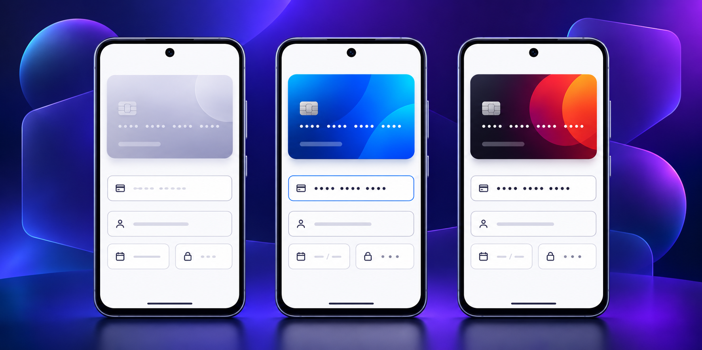

# Compose Cards

<p align="center">
  <strong>A polished, Material 3 payment-card form for Android, built entirely with Jetpack Compose.</strong>
</p>

<p align="center">
  <a href="https://developer.android.com/jetpack/compose"></a>
  
  
  
</p>

<p align="center">
  
</p>

Compose Cards is a UI-only library for collecting and previewing credit or debit card details. It recognises common card brands, formats the PAN as it is entered, shows the card back while CVV is focused, and gives the host app control of submission. It does not send, store, tokenise, or process payment information.

<p align="center">
  
</p>

## Highlights

- 100% Jetpack Compose with a Material 3 UI.
- Card-brand recognition for Visa, Mastercard, American Express, RuPay, Maestro, and Diners Club.
- Responsive card preview with focused-CVV flip animation.
- Digit-only PAN, expiry, and CVV handling, with 19-digit PAN support.
- A small, host-controlled `onSave` callback; no network, permissions, analytics, or payment processing.
- Modern Android build stack: AGP 9.4, Gradle 9.6, Kotlin 2.3.21, Compose BOM 2026.08.00, and compile/target SDK 37.

## Requirements

| Requirement | Version |
| --- | --- |
| Android min SDK | 25 (Android 7.1) |
| Compile / target SDK | 37 |
| JDK | 17 |
| Kotlin | 2.3.21 |
| Android Gradle Plugin | 9.4.0 |

## Add it to your project

### Option 1: JitPack

Add JitPack to `settings.gradle.kts`:

```kotlin
dependencyResolutionManagement {
    repositories {
        google()
        mavenCentral()
        maven("https://jitpack.io")
    }
}
```

Then use the release tag you want in your app module. Once the `2.0.0` tag is published, for example:

```kotlin
dependencies {
    implementation("com.github.myofficework000:Cards:2.0.0")
}
```

### Option 2: Use the module locally

For a checkout of this repository, include the `cards` module and depend on it directly:

```kotlin
dependencies {
    implementation(project(":cards"))
}
```

## Quick start

Wrap the form in your app theme and handle the Save action. The values are delivered only to your callback.

```kotlin
class MainActivity : ComponentActivity() {
    override fun onCreate(savedInstanceState: Bundle?) {
        super.onCreate(savedInstanceState)
        enableEdgeToEdge()
        setContent {
            MyAppTheme {
                CardDetails { input ->
                    // Send input to your PCI-compliant payment/tokenisation flow.
                    // Do not persist raw card numbers or CVVs.
                }
            }
        }
    }
}
```

If you only need the presentation, use `CreditCard` directly:

```kotlin
CreditCard(
    cardNumber = "4111111111111111",
    holderName = "Taylor Morgan",
    expiryDate = "1228",
    cardCvv = "123",
    isBackVisible = false,
)
```

## Customisation and behaviour

`CardDetails` exposes a modifier and a submission callback:

```kotlin
CardDetails(
    modifier = Modifier.fillMaxSize(),
    onSave = { cardInput -> /* validate/tokenise in the host app */ },
)
```

The bundled demo app applies `ComposeCardsTheme`, but the library itself uses Material 3 theme tokens for typography and controls, so it inherits a host application's Material 3 theme naturally.

## Run the sample

```bash
git clone https://github.com/myofficework000/Cards.git
cd Cards
./gradlew :app:assembleDebug
```

Open the project in a current Android Studio release, select an emulator or device running Android 7.1+, and run the `app` configuration.

## Security note

This repository provides a visual input component, not a PCI-compliant payment solution. In production, use your payment processor's approved SDK or tokenisation flow and avoid logging, storing, or transmitting raw PAN/CVV values yourself.

## License

Copyright 2024–2026 Abhishek Pathak

Licensed under the [Apache License, Version 2.0](https://www.apache.org/licenses/LICENSE-2.0).

## Connect

- [GitHub](https://github.com/myofficework000)
- [LinkedIn](https://www.linkedin.com/in/myofficework/)
- [Medium](https://medium.com/@myofficework000)

If this library helps, a star on the repository is greatly appreciated.
